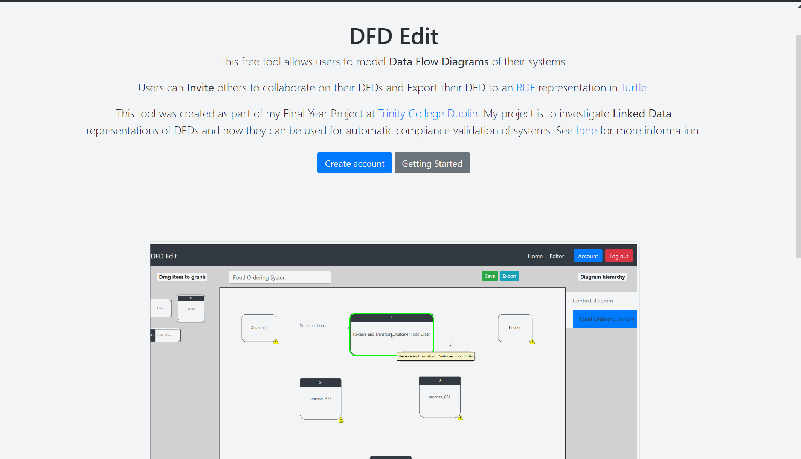
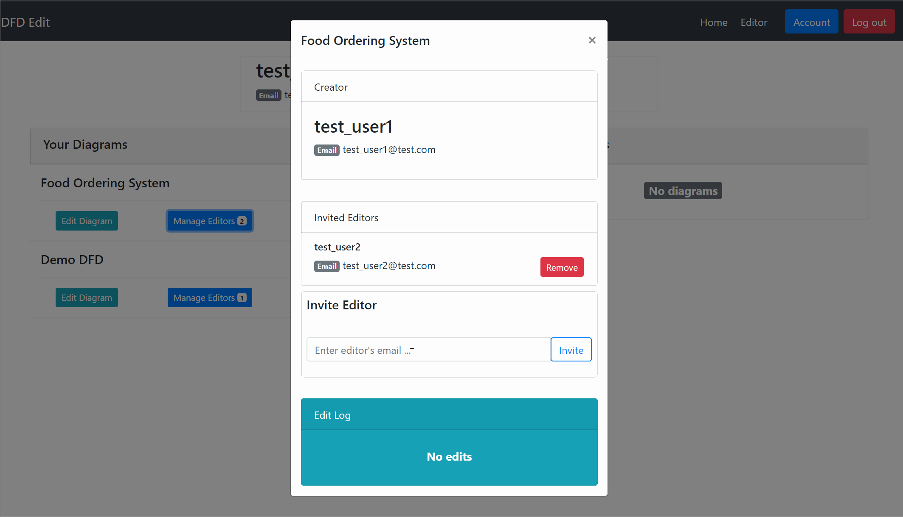

# DFD_Edit

This tool allows users to model **Data Flow Diagrams** of their systems.

Users can Invite others to collaborate on their DFDs and Export their DFD to an **RDF** representation in **Turtle**.

This tool was created as part of my Final Year Project at Trinity College Dublin. My project is to investigate **Linked Data** representations of DFDs and how they can be used for automatic compliance validation of systems.

## Screen Shots

### Home page



### Editor


### Account page



## Run Local

#### Download the code and navigate to this directory.

```bash
git clone https://github.com/SeanFitz1997/DFD_Edit
cd DFD_Edit
```

#### Install dependencies
* Requires python 3.6 (or higher)
* Requires [pipenv](https://pypi.org/project/pipenv/)
```bash
pipenv install
```

#### Create a secret key

`Option 1: Set a environment variable`

```bash
(If using bash)
$vim ~/.bashrc
#add to bottom of the file
export DFD_EDIT=<RANDOM-VALUE>
```

If windows see [here](http://www.dowdandassociates.com/blog/content/howto-set-an-environment-variable-in-windows-command-line-and-registry/)

`Option 2: Add secret key to App/__init__.py`
Change this line to
```Python
app.config['SECRET_KEY'] = "<RANDOM-VALUE>"
```

I recommend to create your random value using
```bash
$ python
Python 3.6.5 (v3.6.5:f59c0932b4, Mar 28 2018, 17:00:18) [MSC v.1900 64 bit (AMD64)] on win32
Type "help", "copyright", "credits" or "license" for more information.
>>> import secrets
>>> secrets.token_urlsafe(16)
'<SECRET>'
```

#### Create Database
This will create a sqlite DB in `App/site.db` and populate it with some demo users and demo DFDs. You can long in with to these accounts with the email: 'test_user1@test.com' (or 2, 3 for the other users) and password 'test'. 
```bash
python create_db.py
```

#### Run server
```bash
python run.py
```

This will allow you to access the site at http://127.0.0.1:5000

## Whats Here
```
App
|-static
|   |- img (site images)
|   |- js
|       |-editor (code for editor page)
|           |- config (key bindings for editor)
|           |- images (images used in editor)
|           |- main.js (contains main function to create editor and diagram hierarchy data structure)
|           |- editor.js (creates editor)
|           |- diagram_hierarchy.js (diagram hierarchy getters & setters and diagram switch event handlers)
|           |- validator.js (validation helper functions)
|           |- save_graph.js (functions for serializing DFD and making save and export requests)
|       |- account.js (Handles users interactions on the account page)
|   |- mxgraph-master (mxgraph library used for drag & drop diagram)
|   |- styles (Custom CSS)
|- templates
|- __init__ (App constructor)
|- models.py (Data models)
|- routes.py (Route definitions)
|- forms.py (Form definitions)
|- exporter.py (RDF export functions)
|- utils.py (Helper functions)
create_db.py (Creates tables and fill with demo data)
run.py (Runs server in debug mode)
```
